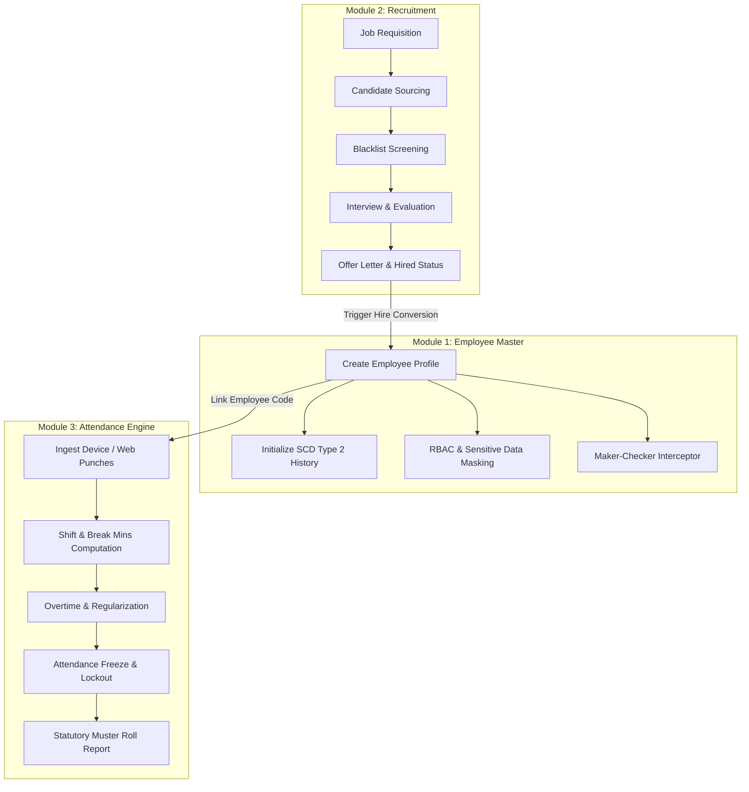
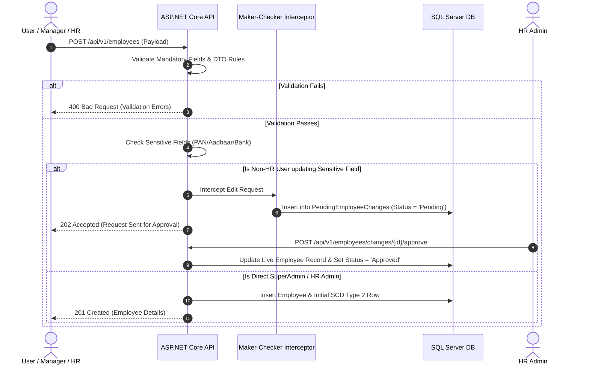
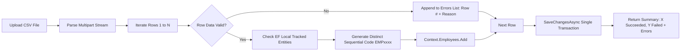
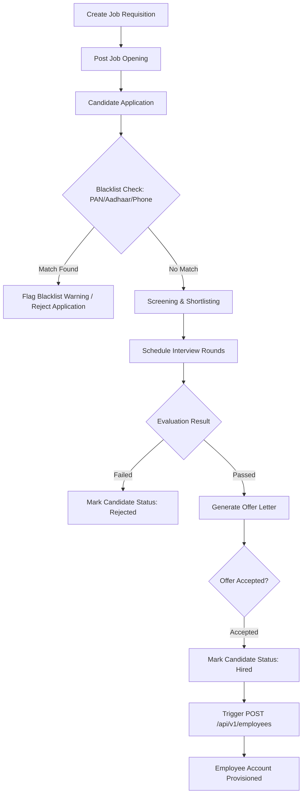
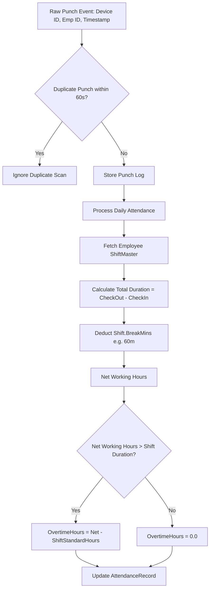
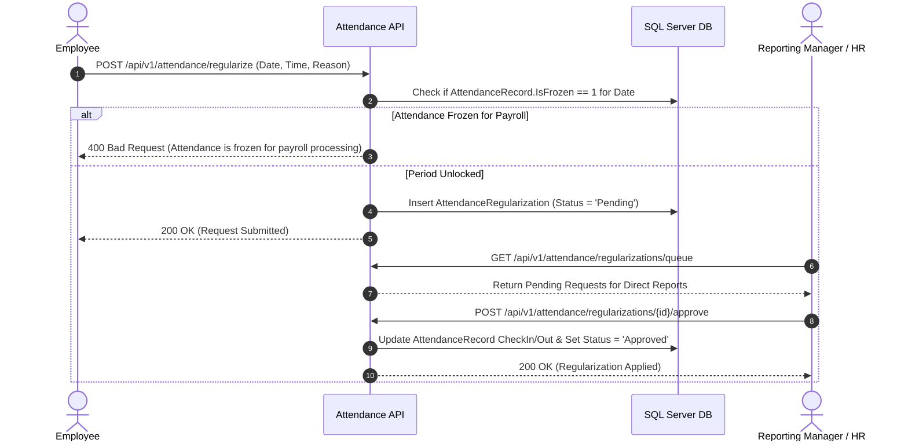
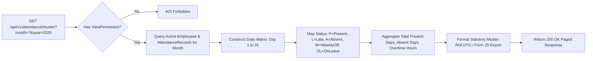

# HRMS 2.0 — Architecture, Workflows & Pipeline Flow Diagrams

This document provides a complete technical explanation of **Module 1 (Employee Master)**, **Module 2 (Recruitment)**, and **Module 3 (Attendance & Punch Processing)**, complete with Mermaid flowcharts, sequence diagrams, and feature comparison maps.

---

## Executive Overview: Architecture & Cross-Module Pipeline

The system is built on a clean 3-Tier Architecture (React Frontend, ASP.NET Core 8 Web API, SQL Server 2022 DB) enforcing module isolation and strict cross-module event flows.



---

## Module 1: Employee Master & Identity Governance

### Core Features
1. **Employee Profile Management**: Maintains demographics, employment dates, grades, cost centers, and contact details.
2. **Maker-Checker Interception**: Sensitive fields (Aadhaar, PAN, Bank account details) trigger a `202 Accepted` response and create an asynchronous pending approval request (`PendingEmployeeChanges`) rather than mutating live records directly.
3. **Slowly Changing Dimension (SCD Type 2)**: Tracks historical department, designation, grade, and manager changes with `EffectiveFrom` and `EffectiveTo` timestamps.
4. **Batch CSV Import Engine**: Handles bulk employee onboarding with automatic sequential code generation (`EMP0001` - `EMP9999`) and partial failure row reporting.
5. **Sensitive Field Masking**: Dynamically masks sensitive identity numbers for standard users while displaying full unmasked values for users holding the `Security.ViewSensitiveData` permission code.

---

### Pipeline 1.1: Employee Creation & Maker-Checker Approval Flow



---

### Pipeline 1.2: SCD Type 2 Historical Versioning Engine

```mermaid
flowchart TD
    A[Update Employee Dept / Designation] --> B{Existing Active Record?}
    B -->|Yes| C[Fetch Current Row where EffectiveTo IS NULL]
    C --> D[Set Current Row EffectiveTo = GETUTCDATE()]
    D --> E[Insert New Row: EffectiveFrom = GETUTCDATE(), EffectiveTo = NULL]
    E --> F[Commit DB Transaction]
    F --> G[GET /employees/{id}/employment-history returns full timeline]
```

---

### Pipeline 1.3: Bulk CSV Import & Batch Code Generator



---

## Module 2: Recruitment & Candidate Pipeline

### Core Features
1. **Job Requisition Management**: Creation, departmental budget verification, and vacancy tracking.
2. **Candidate Sourcing & Screening**: Captures candidate details, resume attachments, and referral sources.
3. **Blacklist Screening Engine**: Performs real-time duplicate and blacklist checks against PAN, Aadhaar, and phone numbers before application submission.
4. **Interviews & Evaluation**: Candidate stage progression (`Applied`, `Screening`, `Interview`, `Offered`, `Hired`, `Rejected`).
5. **Conversion to Employee**: Hired candidate auto-populates the Employee onboarding form.

---

### Pipeline 2.1: End-to-End Candidate Sourcing & Hiring Flow



---

## Module 3: Attendance & Punch Processing Engine

### Core Features
1. **Multi-Channel Punch Ingestion**: Ingests attendance scans from biometrics, mobile GPS, and web logs.
2. **Multi-Scan Retention**: Retains all raw daily punches while identifying the earliest `CheckIn` and latest `CheckOut`.
3. **Break Deduction & Overtime Calculation**: Deducts `BreakMins` (e.g. 60 mins) from total duration to compute accurate `WorkingHours` and `OvertimeHours`.
4. **Month Freeze / Payroll Protection**: Prevents attendance regularizations or modifications inside frozen date ranges (`IsFrozen = 1`).
5. **Statutory Muster Roll Engine**: Generates monthly statutory compliance reports (Form 25).

---

### Pipeline 3.1: Punch Ingestion & Daily Working Hours Calculation



---

### Pipeline 3.2: Attendance Regularization & Freeze Lockout Flow



---

### Pipeline 3.3: Statutory Muster Roll Reporting Flow



---

## Summary Matrix of Module Pipelines

| Module | Pipeline / Process | Trigger | Key Entity / Table | Output / Result |
| :--- | :--- | :--- | :--- | :--- |
| **M1** | Maker-Checker Approval | Sensitive Edit by Non-Admin | `PendingEmployeeChanges` | HTTP 202, Dual-Control Approval |
| **M1** | SCD Type 2 History | Dept / Designation Edit | `EmployeeEmploymentHistory` | Complete Employment Timeline |
| **M1** | Bulk Onboarding | CSV Stream Upload | `Employees` | Batch import with sequential codes |
| **M2** | Candidate Sourcing | Job Application | `Candidates`, `JobApplications` | Blacklist Check & Stage Progress |
| **M2** | Hiring Conversion | Offer Acceptance | `Candidates` -> `Employees` | Provisioned Employee Record |
| **M3** | Punch Processing | Biometric / Web Scan | `AttendanceRecords` | Net Hours & Overtime Logged |
| **M3** | Regularization Lockout | Employee Request | `AttendanceRegularizations` | Approved Punch or Freeze Block |
| **M3** | Statutory Muster Roll | Monthly Compliance Request | `AttendanceRecords` | Form 25 Legal Compliance Matrix |
